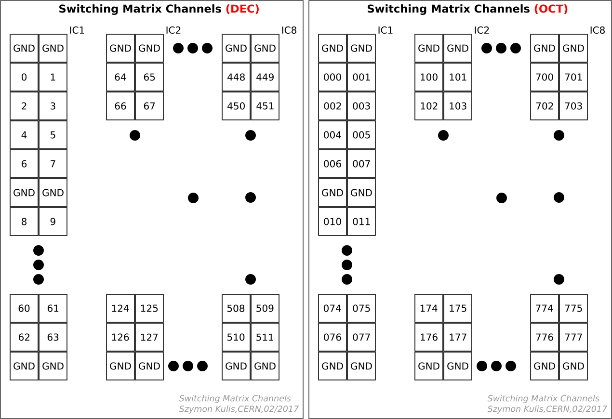

# Overview

ARRAY is a system for silicon sensor testing. It consisting of two Printed Circuit Boards: an active 512-to-1 switching matrix and a passive probe card to contact the sensor. 
It has been use to characterise large area silicon pad sensors for the CMS (HGCAL) and FCAL (LumiCal) collaborations. 
A description of the system is published in NIM A (in submission) and [arXiv](https://arxiv.org/abs/1903.10262).

All design files are open source:
* The hardware design files for both PCBs can be found [here](https://ohwr.org/project/array/array-hardware).
* The firmware can be found [here](https://ohwr.org/project/array/array-firmware).
* A python interface can be found [here](https://ohwr.org/project/array/array-interface-python).
* A LabVIEW interface can be found [here](https://ohwr.org/project/array/array-interface-labview).

For more detailed documentation, please refer to the [wiki page](https://ohwr.org/project/array/array/wikis/home).
For CMS specific documentation, please refer to the [CMS Twiki](https://twiki.cern.ch/twiki/bin/view/CMS/HGCALSiliconSensorTesting) (protected).

## Hardware

* Switch card design can be found [here](https://ohwr.org/project/array/array-hardware/Switching_Matrix)
  - [schematic](https://ohwr.org/project/array/array-hardware/blob/master/Switching_Matrix/Schematics/EDA-03518-V3-0_sch.pdf)
  - [layout](https://ohwr.org/project/array/array-hardware/blob/master/Switching_Matrix/PCB_Layout/EDA-03518-V3-0_pcb.pdf)
* Probe card design can be found [here](https://ohwr.org/project/array/array-hardware/Probe_Card)
  - [schematic](https://ohwr.org/project/array/array-hardware/blob/master/Probe_Card/Schematics/EDA-03517-V2-0_sch.pdf)
  - [layout](https://ohwr.org/project/array/array-hardware/blob/master/Probe_Card/PCB_Layout/EDA-03517-V2-0_pcb.pdf)

## Images

{:width="50%"}

Switching matrix

Probe card

Circuit

